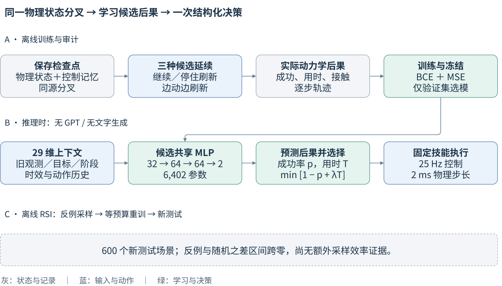
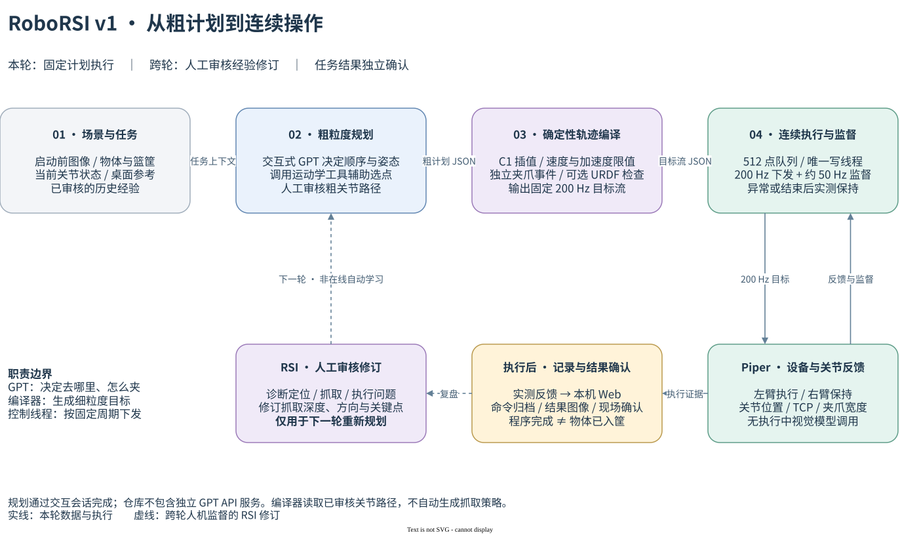
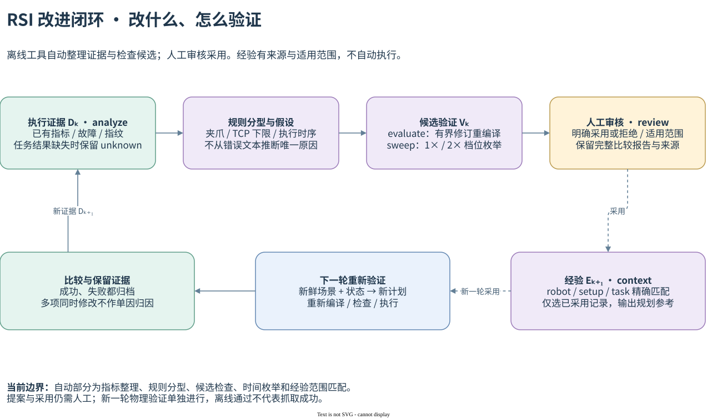
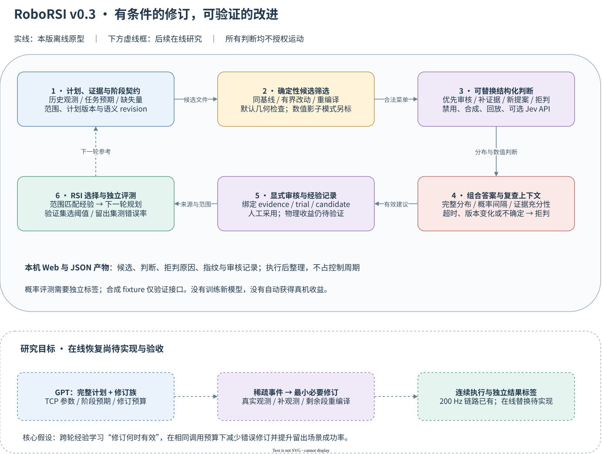
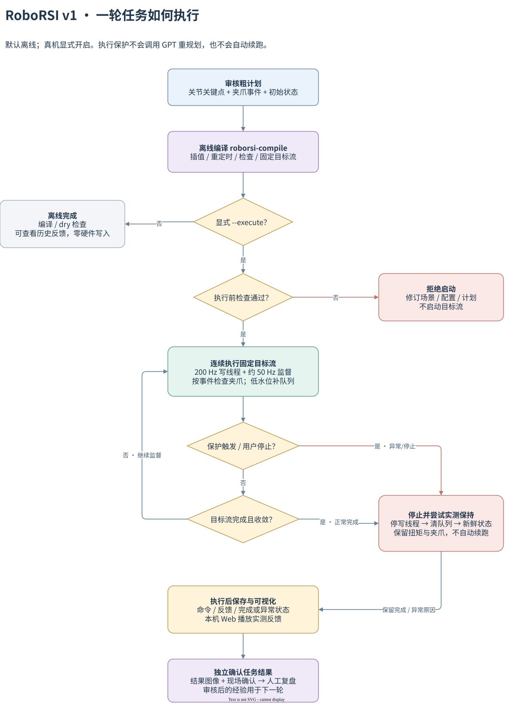
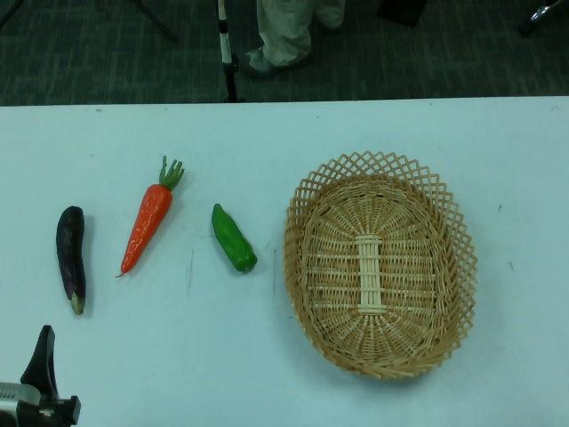

<div align="center">

# RoboRSI v1

**粗规划与连续控制 · 结构化判断 · 可审计的 RSI**

Plan → Check → Judge → Review → Improve · v0.3

[独立判断与 RSI](#独立非生成式判断研究) · [Piper 四层架构](#系统架构) · [本机论文档案](#本机论文实验档案) · [快速开始](#快速开始) · [Jev 调研](docs/JEV_RESEARCH_2026_09.md) · [文档导航](docs/README.md)

</div>

RoboRSI 包含两条研究路径：Piper 上的粗规划与连续执行，以及不依赖 GPT 的 MuJoCo 判断器与离线 RSI。前者已记录 GPT 粗规划、确定性编译和 200 Hz 控制的抓取实验；后者用可恢复的物理分叉训练小模型，并通过新场景和等预算对照检验更新是否有效。

**Piper 路径实现：固定计划执行 + 结构化判断接口 + 人工审核。** v0.3 提供阶段预期检查、可替换判断器、拒判与过时回复检查、分组留出评测，并将判断记录接入经验与本机 Web。默认全部离线；Jev 是可选服务接口，合成 demo 不调用真实模型。

研究方向是**意图约束的稀疏轨迹修订**：GPT 给出完整计划与阶段预期，只有偏差值得处理时才比较修订；RSI 积累修订有效的条件。在线感知、剩余轨迹替换与自主恢复尚待实现。已记录的成功实验仍是交互式 GPT 粗规划、小 VLM 关闭的固定计划版本。

## 独立非生成式判断研究

研究分支 `research/mujoco-jev-rsi` 包含三轮解析实验、两轮 MuJoCo 判断研究和一轮离线 RSI 更新。基础判断实验从同一物理检查点分叉，训练 6,402 参数模型选择继续、同步刷新或异步刷新：1,500 检查点、4,500 分支、12 个模型与 30 段逐步一致录像。随后完成 600 个新测试场景的等预算更新检验，另保存 30 段归档状态回放。

最新分支 `research/queue-evidence` 继续检验已提交动作队列与延迟证据：90 个父状态、1,080 条分支、16 段状态回放。预设机制门槛未通过，因此没有训练新模型；事后简单时间对齐已完成 269/270 队列分支，说明固定偏置传感器假设需要改进。[完整反证与下一步](docs/QUEUE_EVIDENCE_STUDY.md)。

当前结果是局部收益与明确负结果：长延迟抓取有改善，同分布阶段查表更强；动作历史独立价值未证实。已完成一轮离线 RSI 等预算更新，但反例采样优于随机补数据的证据不足；图像输入和全任务持续判断仍待验证。它不调用官方 Jev，也不替代下方已验证的 Piper 固定计划链路。

[RSI 更新检验与 CPU 开销](docs/RSI_ACQUISITION_STUDY.md) · [实际 pipeline 与全部实验](docs/STANDALONE_SYSTEM_ONE.md) · [MuJoCo 协议与结果](docs/MUJOCO_JEV_STUDY.md) · [中文研究稿 PDF](docs/manuscript/draft_cn.pdf) · [近期会议与模板](docs/manuscript/README.md)



[可编辑框架图](docs/manuscript/phase_pipeline.drawio)。本机启动 `python -m http.server 8790 --bind 127.0.0.1`，打开 `http://127.0.0.1:8790/paper/`；浅色单页包含最新机制检验、RSI 指标、消融、曲线、候选同步视频和观测年龄/接触过程。

## 系统架构

下图描述 Piper 固定计划路径；独立 MuJoCo 学习路径见上方框架图与实验文档。



[查看架构详解](docs/ARCHITECTURE.md) · [可编辑 draw.io](docs/figures/architecture.drawio) · [PNG](docs/figures/architecture.png)

| 层次 | 负责什么 | 跨层产物 | 当前实现 |
| --- | --- | --- | --- |
| **L1 · RSI 跨轮改进** | 证据/契约、候选验证、结构化判断、审核与经验选择 | 带概率、拒判原因、指纹和适用范围的记录 | `roborsi-rsi` 离线工具 + 可选 provider + 人工审核 |
| **L2 · 任务规划** | 选用经验，确定物体顺序、姿态、粗关节关键点 | 审核后的粗计划 JSON | 交互式 GPT + IK 工具 |
| **L3 · 轨迹编译** | 插值、重定时、动态/几何检查、夹爪事件 | 固定 200 Hz 目标流 JSON | 确定性编译代码 |
| **L4 · 执行与反馈** | 下发目标、读反馈、保护保持、保存证据 | 命令、实测状态、执行结果 | 控制适配与本机 Web |

经验向下进入规划，执行证据向上返回 RSI。**RSI 决定下一轮改什么；执行层决定本轮何时发命令与停止。**

**任务层视觉开环，设备层关节反馈与软件保护持续工作。** GPT 不逐点生成 200 Hz 命令；执行保护不会自动调用 GPT 修改剩余轨迹；程序完成不等于物体已经入筐。

## RSI 跨轮闭环



RSI 的输入是本轮证据，输出是**经过审核、带适用条件的下一轮修订**。工具自动区分故障观测与原因假设，对候选重新编译，并按 robot / setup / task 精确选取已审核的经验。规划者结合新场景使用这些记录。

离线验证分别报告数值约束与几何检查；没有 URDF 就标记几何未检查，程序完成也不会自动变成任务成功。当前的自动搜索仅比较已有时间配置，生成式抓取修订和自主真机迭代仍待实现。

| 已记录实例 | 改进过程 |
| --- | --- |
| 前轮 | 青椒空夹，夹爪检查失败，停止并保留证据 |
| 修订 | 调整抓取深度与方向，审核后用于新计划 |
| 后轮 | 三物体入筐，结果图像与现场确认一致 |

该例展示可追溯的跨轮改进。深度与方向同时改变，不能据此证明某一个改动的独立收益；单次成功也不是长期成功率。

[RSI 命令与接口](docs/RSI.md) · [近期论文与研究路线](docs/RESEARCH_2026_09.md) · [真实修订案例](experiments/2026-09-17/rsi_review.md) · [可编辑闭环图](docs/figures/rsi_cycle.drawio)

## v0.3：判断何时值得修订



判断器可以输出**优先审核某个候选、补充证据、请求新候选或拒判**。模型建议必须属于已验证菜单，并通过概率、证据和时效检查。关联阶段契约时，推理前后还会核对计划、阶段与语义观测版本；过时回复不会成为有效审核建议。

RSI 的研究目标是逐步学会“哪种条件下哪种修订有效”。v0.3 离线接口提供可追溯记录与评测工具；上方研究分支另行训练了数值状态判断器，尚未训练可直接接管 Piper 的模型。独立留出集的表现才是改进证据。Jev 官方接口、本地开放模型及规则都可以参与同条件比较。

[完整方案与消融](docs/RESEARCH_PROPOSAL.md) · [11 项 Jev 生态与论文调研](docs/JEV_RESEARCH_2026_09.md) · [命令、provider 和数据格式](docs/TYPED_JUDGMENT.md) · [可编辑图](docs/figures/typed_judgment.drawio)

## 一轮任务怎么走

审核粗计划 → 离线编译 → 执行前检查 → 连续下发与监督 → 实测保持 → 保存反馈 → 独立确认任务结果。

默认流程止于离线编译或 dry 检查。硬件执行必须显式开启；正常结束和保护停止都会进入保持流程，保护停止不会自动续跑。详见[执行流程与分支说明](docs/EXECUTION_FLOW.md)。

<details>
<summary>展开查看完整执行流程图</summary>



[可编辑 draw.io](docs/figures/execution_flow.drawio) · [PNG](docs/figures/execution_flow.png)

</details>

## 快速开始

Python 3.10+，依赖 NumPy、SciPy 和 PyYAML。默认流程不需要机器人、相机或模型服务；以下命令在仓库根目录执行。

```bash
git clone https://github.com/Srt-tian/RoboRSI_v1.git
cd RoboRSI_v1
python3 -m venv .venv
source .venv/bin/activate
python -m pip install -e .
```

**1. 编译已记录的粗计划，不连接机器人。**

```bash
roborsi-compile examples/three_objects.json \
  --speed 2 --tcp-floor 0 --output runs/three_objects.stream.json
```

生成 **17,046 个目标**，计划时长 **85.23 s**。输出路径必须不存在，以免覆盖计划。示例绑定历史场景，始终不可直接发到真机；未提供 `--urdf` 时，输出的 `geometry_verified` 为 `false`。这里的 `--tcp-floor 0` 是历史复算参数，不能直接套用到新的装配环境。

**2. 在本机查看实测反馈。**

```bash
roborsi-report experiments/2026-09-17/servo20_three_deep.jsonl.feedback.jsonl \
  --output runs/viewer
python -m http.server 8786 --bind 127.0.0.1 --directory runs/viewer
```

打开 **http://127.0.0.1:8786/**，可播放、单步和拖动时间轴，查看跟踪误差、TCP、夹爪开度及队列状态。这里播放的是约 **50 Hz 实测反馈**，不是 200 Hz 计划点。结果照片及任务成败保存在实验记录中，不由查看器自动判断。

**3. 一次生成离线 RSI 工作台。**

```bash
roborsi-rsi workbench \
  --metrics experiments/2026-09-17/metrics.json \
  --program examples/three_objects.json \
  --tcp-floor 0 --output runs/rsi_demo
python -m http.server 8787 --bind 127.0.0.1 --directory runs/rsi_demo
```

打开 **http://127.0.0.1:8787/**，查看历史失败、诊断假设、候选预计耗时与证据指纹；也可直接打开生成的 `index.html`。所有计算都在本机离线完成。该示例复算历史配置，未提供 URDF，不验证新场景的几何或抓取结果。

**4. 查看结构化判断与拒判示例。**

```bash
python scripts/demo_judgment.py --output runs/judgment_demo
python -m http.server 8788 --bind 127.0.0.1 --directory runs/judgment_demo
```

打开 **http://127.0.0.1:8788/**。该示例使用真实历史指标做复盘，判断回复与独立契约/概率样例明确标为合成数据，真实模型调用为 **0**。它展示接口与报告，不证明新模型的抓取能力。使用现有环境可加 `PYTHONPATH=src` 运行。

**5. 验证代码与实验归档。**

```bash
python -m unittest discover -s tests -v
python scripts/verify_evidence.py
```

使用已有环境时，也可通过 `PYTHONPATH=src python -m roborsi.compiler ...` 和 `PYTHONPATH=src python -m roborsi.reporting ...` 运行。硬件接口另见[硬件接入指南](docs/HARDWARE.md)。

## 本机论文实验档案

```bash
python -m http.server 8790 --bind 127.0.0.1
```

在仓库根目录启动后，打开 **http://127.0.0.1:8790/paper/**。其中旧规则仿真保存 **576 个 episode、269,616 条逐步状态、6 段 MP4 对照视频**，以及 CSV、可编辑 SVG 结果表、配置、源码/文件指纹。可选择全部种子、5 ms 单步查看过程，并下载单个 episode。

当前仿真验证阶段检查、移位、遮挡、滑落、延迟和版本复查逻辑，使用运动学抓取代理与共同规则提案器，**没有调用 Jev/GPT，也不模拟 Piper 动力学**。等待期间二次移位的场景中，版本复查阻止了 24 次过时采纳，但即时规则仍是更快的基线；这些结果不能称为学习模型收益。

[仿真假设与完整结果](docs/SIMULATION.md) · [封存运行](experiments/simulation/2026-09-22/run_001/) · [四方法对照视频](experiments/simulation/2026-09-22/run_001/videos/shift_during_wait.mp4) · [过程浏览页](paper/process.html)

## 已记录的实验结果

2026-09-17，物理左臂依次将 **青椒 → 胡萝卜 → 茄子** 放入篮筐并回位。该轮没有中途重新规划或保护暂停。

| 指标 | 记录值 |
| --- | ---: |
| 任务结果 | **3 / 3 入筐**，结束图像与现场确认一致 |
| 实际执行耗时 | **85.42 s** |
| 主机目标发送频率 | **200.000 Hz** |
| 指令间隔 P99 | **5.116 ms** |
| 指令 / 实测反馈记录 | **17,046 / 4,228** 条 |
| 执行中视觉 / 小 VLM 调用 | **0 / 0** |

| 执行前 | 执行后 |
| :---: | :---: |
|  |  |

这是已记录的单轮结果，**不是长期成功率或严格对照实验**。200 Hz 指主机发送频率，不代表电机内部控制环频率。真机数据来自实验版本；当前仓库代码完成离线回归，尚未以整理后的版本重新完成真机验收。

[成功与失败记录](docs/EXPERIMENTS.md) · [指标数据](experiments/2026-09-17/metrics.json) · [归档校验清单](experiments/2026-09-17/manifest.json)

## 实现与扩展入口

```text
src/roborsi/
├── system_one/     # 独立数值判断研究与解析仿真
├── rsi/            # L1：契约、候选、判断/拒判、留出评分、审核经验与本机 Web
├── ik.py           # FK / Jacobian / 有界 IK，供规划阶段使用
├── geometry.py     # 当前装配的几何检查
├── smoothing.py    # C1 插值与速度、加速度受限重定时
├── compiler.py     # 粗关节计划 → 目标流与夹爪事件
├── validation.py   # 目标流结构与数值检查
├── runtime.py      # 队列补充、控制后端适配、反馈监督
├── hold.py         # 停止、清队列与新鲜实测保持
└── reporting.py    # 执行后本机反馈查看器
examples/           # 不可直接真机重放的历史计划
experiments/        # 命令、反馈、图片、指标与原始归档
paper/              # 本机论文档案、全量过程浏览、历史反馈与判断示例
docs/               # 架构、流程、接入与实验说明
scripts/            # 图生成器、判断 demo、仿真视频与论文归档工具
tests/              # 离线测试
```

编译器接收已审核的 **Nx6 左臂关节路径**，不会自动把图像转换为抓取轨迹。右臂在本版本保持，几何检查依赖当前双臂装配，并非通用碰撞规划器。机械臂适配、数据字段与源码映射见[架构详解](docs/ARCHITECTURE.md)。

近期 Zetta、ROBUST TAMP、Jev-Mem 等工作与这条路线有明显交集。论文贡献需要通过相同候选库、调用预算和复位协议下的对照实验建立，见[研究方案](docs/RESEARCH_PROPOSAL.md)。

[开发与文档维护](CONTRIBUTING.md) · [完整文档导航](docs/README.md) · [依赖与证据边界](docs/PROVENANCE.md)
